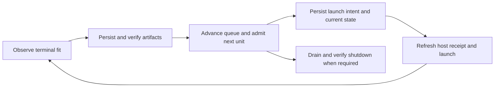

# GPU runtime efficiency implementation plan

Status: **Release 1 partially implemented and CPU-tested**, 2026-09-17. This
document separates implemented controls from remaining rollout work; it does
not restart the paused campaign or claim a measured
speedup. The objective is more **verified, scientifically comparable fits per
allocated GPU-hour**, with fewer setup cycles and shorter gaps between fits.

Implement the orchestration improvements first. Keep a healthy owned VM across
many fits, automate the routine transitions, and remove redundant preparation.
Measure the remaining CPU/GPU bottlenecks before changing training behavior.

## Authority and scope

Implemented in the first continuation: durable pause/control generations,
exclusive host-controller leases, exactly-once closed host accounting,
an existing-endpoint queue supervisor, verified terminal/state persistence,
idempotent launch intents, bounded reconnects and explicit per-fit persistence
allowances. The supervisor verifies already-staged setup rather than reinstalling
it. It has no allocation/replacement path. CPU fake-provider tests exercise
multiple fits, lost replies, duplicate launches, pauses, corrupt receipts and
verified shutdown; live Colab transport and throughput remain unmeasured.

Remaining Release 1 rollout work includes freezing the operational continuation,
provisioning/staging automation and a separately resumed live segment. Releases
2/3 remain planned. Do not interpret the local queue tests as complete
end-to-end Colab readiness or a measured speedup.

- [Plan.md](../Plan.md) owns scientific policy. The
  [metal playbook](METAL_TRAINING_PIPELINE_PLAYBOOK.md#single-gpu-metal-campaign)
  owns the executable campaign recipe, budgets and admission rules.
- [Current status](../EXPERIMENT_STATUS.md) owns the pause, allocation accounting
  and next action. This planning request does not cancel the user's STOP.
- [The Colab runbook](COLAB_GPU_RUNBOOK.md) owns operating procedures;
  [TECH-014](FOLLOW_UP_TECHNICAL_ISSUES.md#tech-014--serial-campaign-orchestration-and-preparation-overhead)
  tracks the verified efficiency problems. This plan owns proposed work and
  performance acceptance criteria until implementation is validated.
- Preserve one allocated GPU and one training process, the current four-hour
  session limit, fifteen-minute closeout reserve, cumulative accounting,
  1.25 admission margin, durable artifacts, and provider-verified shutdown.
- Keep the scientific grid, targets, epochs, batch size, seeds, folds, losses,
  normalization, selection rules and held-out exclusion fixed in the first
  release. This campaign does not authorize Stage 6B or Stage 7.

## Measured baseline and limits of the evidence

The audited completed allocation lasted **30.56 minutes**. Two probes and one
full fit accounted for **7.39 minutes**; **23.18 minutes (75.8%)** fell outside
attempt execution. That remainder includes setup, transfers, checks and
orchestration; it is not all proven avoidable idle time. See the
[allocation receipt](notebook_outputs/raw/metal_single_gpu_authorized_20260917/session8_stopped.json)
and [attempt evidence](notebook_outputs/raw/metal_single_gpu_authorized_20260917/README.md).

The full fit's [performance profile](notebook_outputs/raw/metal_single_gpu_authorized_20260917/attempt_00018/performance_profile.json)
records **91.66 seconds preparing** and **143.76 seconds in the training
region**, out of 235.42 seconds inside the profiled process. The controller's
236.40-second duration also includes its launch/completion overhead. The
training-region timer includes work beyond CUDA kernels; neither timer is
actual GPU utilization. A CUDA utilization trace was not captured.

The audited pre-Release-1 code exposed these constraints; the implemented
continuation and remaining rollout boundaries are distinguished above:

| Observed implementation | Consequence |
|---|---|
| `workflow.execute()` executes one fit; current transport orchestration lives in a temporary host script | Routine persistence, admission and launch still need a maintained automatic controller |
| `runtime.authorize_budget()` refuses an open allocation; host receipts bind the prepared authorization digest | The last budget increase required a VM stop under the current implementation |
| `verify_state_transfer()` and `record_persistence()` require independent byte readback | Removing archive re-uploads needs a new verified protocol, not deletion of checks |
| `prepare_run()` reloads pockets, constructs graphs and fits normalization for each process | Repeated compatible fits have a potential preparation cache opportunity; the 92-second timer needs finer attribution |
| AMP, loader workers and pinned memory already exist; the recorded fit uses pinned memory, zero workers and no AMP | These are existing controls, not missing features; changing them is a separate benchmark decision |

## Work order

### 1. Prepare everything possible before allocating

**Deliverable:** one validated launch package and a durable campaign pause flag.

Reconcile the last host-only allocation into worker accounting exactly once,
using its actual stop receipt. Preserve verified attempts and the latest state
snapshot. Check the existing user pause before any launch, recovery or
allocation; a fresh explicit resume instruction is required to clear it.
Replace dependence on suspending a particular agent process with a persistent
stop/continue state that every campaign controller obeys.

Before provisioning, freeze the authorized ceilings and source package, prepare
commands, verify local manifests and archives, resolve dependency compatibility,
and test controller transitions with a fake provider. Prepare a manifest-listed
training-input package where practical, retaining original bundle/overlay hashes
and exact cohort coverage. Do not regenerate ESM, RING or external features.

On the VM, stage inputs on local SSD once, preserve stock Colab PyTorch, verify
CUDA and the actual assigned hardware, then run the required readiness/anchor
checks. Reuse the same staged inputs for subsequent fits. Setup must be
idempotent: reconnecting to a healthy endpoint does not repeat cloning,
installation, extraction or restoration when the recorded identities match.
Verify the durable destination before the queue starts; avoid interactive
authorization prompts after a fit is ready to run.

**Acceptance:** a repeated setup invocation on the same verified VM performs
checks without downloading or rebuilding unchanged inputs. No allocation
occurs while local preparation or the user's pause is unresolved.

### 2. Run a maintained queue controller without conversational delays

**Deliverable:** a detached host supervisor using the existing runtime and
workflow functions. Move the useful temporary operator logic into reviewed
project code; do not require another Codex turn between fits.

The host remains the allocation/authorization owner. Training subprocesses run
detached on the same VM. Keep the existing controller lock and one-worker lock;
add a campaign-wide host-controller lease so two chats cannot operate the same
queue. Lease recovery requires owner/process/boot evidence, not PID alone.

The automatic loop is explicit and bounded:

Each transition is idempotent, logged and restartable. Refresh the existing
120-second host receipt immediately before launch and validate it again at the
actual process start. Preserve all scientific comparison reservations. A
terminal failure is saved and diagnosed; an exception never means “allocate
another VM and try again.” Training retry limits remain unchanged.

Use a lightweight remote completion/status file and adaptive observation so a
finished fit is detected promptly. Batch log-tail and state queries. Human
progress summaries can be less frequent than completion checks. The independent
watchdog's existing 5-second heartbeat and 20-second freshness check remain
unchanged; slower reporting must not weaken shutdown or launch protection.

The watchdog is a separate local process, so it does not survive loss of the
entire host. Block new worker launches when fresh host authorization is absent.
Before claiming unattended shutdown through host power/network loss, verify a
provider-supported VM-side deadline/release path; otherwise retain reliable
host supervision and state that limitation explicitly. A training-process exit
alone does not release a billable VM.

**Acceptance:** multiple planned fits execute on one endpoint without agent
intervention; stale receipts, duplicate controllers, a user pause and unverified
artifacts all prevent a new launch. The first release keeps a fresh training
process per fit, avoiding accidental model/optimizer/RNG carryover.

### 3. Shorten persistence while keeping every completed fit recoverable

**First release:** automate and batch the current verified-transfer sequence.
Package the terminal fit once, verify the host copy, preserve the required
independent readback, then persist the next launch intent and current state in
as few round trips as the existing contract permits. Keep checkpoints, configs,
normalization, metrics, provenance and failed-attempt logs. Move optional plots,
large presentation reports and repeated human summaries off the launch path.

**Later optimization:** add one explicitly supported durable-destination
acknowledgement protocol. After copying immutable artifacts from VM SSD, the
destination must independently read the saved bytes and acknowledge the exact
attempt, inventory hash, state generation and request identity through the
trusted host channel. Only then may the worker mark persistence complete. A
worker-local second copy or a claimed successful upload is insufficient.

This new protocol may remove the host-to-VM re-upload of the same archive. Until
its failure tests pass, retain the existing readback path. Transfer only new
immutable artifacts and changed state objects using a full manifest that
references already verified objects. Never omit a dependency needed for
recovery. The current recovery contract requires historical artifacts restored
at their frozen paths; lazy restoration needs its own tested implementation.

Keep **zero terminal attempts awaiting durable acknowledgement at the next fit
launch** in the first release. Optional derived reporting can overlap the next
fit after required persistence succeeds. Existing `verify_persistence(full=False)`
already limits routine byte rechecks to the latest terminal attempt; preserve
that behavior and full recovery/closeout verification.

**Acceptance:** simulated lost acknowledgement, interrupted upload, stale
receipt, corrupt bytes and VM death never lose an accepted completed result or
cause a duplicate fit. Measure transfer time and bytes before and after batching.

### 4. Reuse healthy allocations and make recovery deliberate

Before each launch, include measured fit cost, its existing safety margin and
bounded persistence time in the remaining training window. That window already
excludes the closeout reserve; do not add the same reserve twice. Keep full
comparison-block admission as well as the per-fit deadline check. Stop admitting
fits when the next unit cannot finish safely, drain persistence, and stop once.

| Event | Planned response |
|---|---|
| Short CLI timeout or closed WebSocket | Reconcile the existing endpoint and exact attempt; reconnect with bounded backoff |
| Training remains alive on that endpoint | Continue observation; no duplicate launch or allocation |
| Ownership/liveness is unresolved | Block new work and reconcile; lack of a response is not proof of VM death |
| Provider proves the old endpoint is gone | Persist the loss record, charge the interval, reconcile the linked attempt, then consider one controlled replacement |
| Authentication/entitlement failure | Follow the Colab runbook; no blind provisioning retries or automatic GPU substitution |
| No runnable work, user pause, or persistent fault | Save state and stop the owned allocation promptly |

Use a configurable no-progress deadline for setup, transfers and recovery, based
on their observed durations. An unchanged log alone is insufficient evidence of
a hung fit. Distinguish measurable CPU preparation from true idle time. Record
every allocation/stop reason. Repeated identical setup failures must open a
circuit breaker for local diagnosis before another paid allocation.

For budget changes, use two steps:

1. **Immediate:** record already authorized ceilings before provisioning. The
   current code still requires teardown for an increase during an allocation;
   obey that restriction until the following protocol exists.
2. **Planned protocol:** at a boundary with no active fit, append the authorized
   increase as a new immutable generation, verify host/worker durable copies,
   and atomically activate matching launch authorization. Never overwrite the
   original host configuration. Bind fresh receipts to that generation and
   reject old receipts. Partial activation blocks launches and is recoverable.
   Keep the original session start, endpoint ownership, monotonic hard deadline,
   watchdog and closeout reserve; an increase cannot extend this VM's lifetime.

The same-session authorization protocol is a later release, with explicit
crash/replay tests. It must not delay the simpler continuous-queue improvement.
Provider-imposed loss remains possible: [Colab does not guarantee resources or
fixed availability](https://research.google.com/colaboratory/faq.html). The aim
is to eliminate avoidable application-driven churn, not promise uninterrupted
provider service.

### 5. Reduce preparation, then profile actual compute

Add timers for input reading, structure parsing, graph construction, feature
loading, normalization, loader wait, device transfer, forward/backward,
validation and saving. Collect timestamped GPU utilization/memory samples
separately. Use a short sampled [PyTorch CPU/CUDA
profile](https://docs.pytorch.org/tutorials/recipes/recipes/profiler_recipe.html)
to identify where kernels wait; do not run an expensive profiler throughout
every fit or mistake summed overlapping CUDA events for wall time.

Start with a versioned cache of deterministic, **unnormalized** graph/features
on local SSD. Cache keys must bind source/schema versions, structure and
feature hashes, pocket identities, graph/geometry/RING settings and feature
selection. Preserve masks, shapes, dtypes and sample order. Keep target mapping,
class weights, split membership and fitted normalization separate. Fit and cache
normalization only for the exact training partition; no fold or validation
leakage is permitted. Recreate model, optimizer, sampler and RNG state per fit.

Retain a cache-off path. Cache misses rebuild; identity mismatches never silently
reuse data. First prove cached and uncached tensors, ordering, normalization,
losses and seeded outputs agree under the unchanged deterministic configuration.
Attribute the preparation timer before claiming all 92 seconds can be removed.

Only after these gains are measured, benchmark remaining compute bottlenecks:

- Pinned memory is already enabled in the recorded run. Inspect whether safe
  nonblocking device transfer helps; the current loop uses `batch.to(device)`.
- Positive loader-worker counts and persistent workers are already supported,
  but the campaign fixes workers to zero. Test alternatives separately before
  changing the recipe; small in-memory graphs may not benefit.
- AMP already exists and is off here. Precision, compilation, batch-size or
  gradient-accumulation changes require separate numerical and reproducibility
  validation. Do not enlarge batches or run simultaneous fits merely to fill
  GPU memory. Apply any accepted runtime change consistently across comparisons.

These are profiling candidates, not automatic switches. PyTorch's
[tuning guide](https://docs.pytorch.org/tutorials/recipes/recipes/tuning_guide.html)
supports workload-specific evaluation of data-loading and transfer settings;
it does not establish a speedup for this graph workload.

## Performance gates

The following are **proposed engineering targets**, not measured improvements,
new scientific budgets, or permission to weaken a persistence/admission check.

| Measure | Target and interpretation |
|---|---|
| Avoidable VM recreation | Zero for routine polling, completed fits or reconnecting to a verified healthy endpoint |
| Fit-completion to next-fit launch | Warm median at most 30 s and p95 at most 60 s; log persistence and admission time separately |
| Warm preparation for compatible cached inputs | At most 30 s, subject to tensor/output equivalence; compare with the same uncached recipe |
| Steady-state attempt duty fraction | At least 85% over a runnable queue segment; this includes preparation and is not GPU utilization |
| Verified full fits per allocated hour | Seek at least 2× improvement on a matched workload that includes setup and persistence; report the achieved ratio, even if lower |
| Actual GPU utilization | Measure per family and phase; no invented baseline or universal 90–100% target |
| Integrity and safety | Every terminal attempt persisted, no duplicate training, no test access, no ledger reset, all owned shutdowns verified |

Report total allocation time without hiding startup, failed attempts or
closeout. Also report training-region duty fraction, actual GPU samples,
time-to-first-fit, bytes transferred, preparation cache hits, inter-fit gaps,
reconnects and full reallocations. Separate probes from full fits and stratify
comparisons by family, capacity, fold and hardware. Better duty fraction alone
does not establish faster computation; verified throughput is the primary goal.
CPU/kernel optimizations must include their startup/compilation cost and keep
the original results valid. These short-run measurements cannot forecast an
entire heterogeneous campaign with a single multiplier.

## Implementation ownership and rollout

| Work | Existing owners / planned additions |
|---|---|
| Host queue, pause, controller lease and allocation reasons | `scripts/colab_serial_metal_host.py`; add a small maintained supervisor module if needed |
| Admission, launch intent, transitions and persistence | `src/serial_metal_campaign/runtime.py`, `workflow.py`, `budget.py` |
| Provenance and reuse checks | `src/serial_metal_campaign/profile.py`, `evidence.py` |
| Phase timing and sampled profiling | `src/train_serial_metal_profile.py`, `src/training/run.py`, `loop.py` |
| Validated graph caching | `src/training/data.py` and `run.py`; a separate cache helper with explicit keys |
| Failure/recovery verification | Existing serial runtime/workflow/host tests, plus focused supervisor/cache tests |

**Release 1:** offline preparation, pause/accounting reconciliation, deterministic
host queue, batched existing persistence, existing fit profiles plus external
timing/telemetry, and controlled same-endpoint recovery. Keep trainer behavior
and source compatibility unchanged. Detailed instrumentation that edits training
sources belongs behind the later provenance boundary. Verify
CPU-only failure scenarios before an explicitly resumed GPU segment.

**Release 2:** independently acknowledged durable transfer and deterministic
preparation caching, each enabled only after its own acceptance checks. Keep
the original path available as a fallback. Runtime-budget rebinding can ship
independently after its protocol tests; it is not a prerequisite for Release 1.

**Release 3, conditional:** changes to data loading, device transfer, precision
or kernels only where profiles show a worthwhile bottleneck and matched
validation demonstrates correctness and faster total completion.

Existing manifests freeze source hashes. Use a separately versioned operational
continuation, never hot-patch a frozen worker or rewrite earlier receipts.
`evidence.scientific_sources()` already distinguishes named orchestration files
from training/model sources: use existing strict reuse checks for compatible
operational changes. Editing training/cache sources changes scientific-source
identity under the current checker. Do not relax it or silently combine those
fits with the old campaign; define and approve their comparison boundary first.
Keep prior successful fits and all allocation charges recoverable throughout.

Before Release 1 is enabled, exercise lost replies, controller restart, duplicate
launch requests, corrupt/stale persistence receipts, provider death, exhausted
training retry, deadline approach, authentication failure and user pause. Prove
that an ambiguous launch is reconciled rather than submitted twice, and that
the watchdog still closes the owned VM if the host supervisor exits.

After explicit resume authorization, validate the release using the next
already-planned fits on a single G4, retaining the required readiness anchor
and scientific queue order. Assess a warm sequence of at least three completed
fits when available; small samples yield provisional tail estimates. Cover
additional families as their scheduled fits arrive rather than generalizing
one small GVP result. If a gate fails, diagnose locally after a safe closeout;
do not enter an automatic allocation loop. Record new measurements in the
experiment evidence and current status, and update executable procedure owners
only when the implementation is actually verified.
