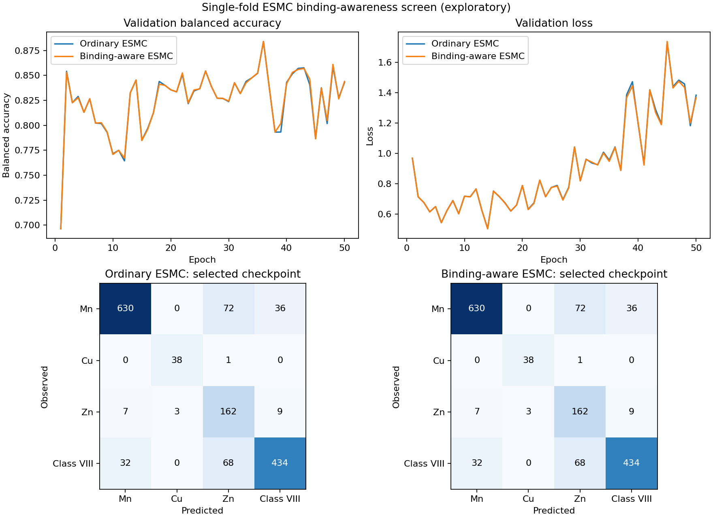

# Exploratory ESMC binding-awareness screen

Frozen fold 0, seed 42; 50 epochs per arm; 1,492 matched validation ions. No held-out access.

| Metric | Ordinary ESMC | Binding-aware ESMC | Difference (pp) |
|---|---:|---:|---:|
| Balanced accuracy | 88.394% | 88.394% | +0.000 |
| Macro-F1 | 84.295% | 84.295% | +0.000 |
| Accuracy | 84.718% | 84.718% | +0.000 |
| Mn recall | 85.366% | 85.366% | +0.000 |
| Cu recall | 97.436% | 97.436% | +0.000 |
| Zn recall | 89.503% | 89.503% | +0.000 |
| Class VIII recall | 81.273% | 81.273% | +0.000 |

Validation-selected epochs: ordinary 36; binding-aware 36.

Both checkpoints passed independent replay and were copied to the verified host backup.

Class predictions changed for 0/1,492 matched validation ions. Maximum absolute probability difference: 0.0673162. Equal selected metrics do not establish identical models or equivalence.

Learned pooling logit biases: `{"esm_graph_encoder.binding_bias.attn_bias": 0.05786170810461044, "esm_graph_encoder.binding_bias.mean_bias": 0.049679066985845566}`.

First-shell coverage: `{"train": {"n_empty_first_shell": 4, "n_graphs": 5906}, "val": {"n_empty_first_shell": 0, "n_graphs": 1492}}`.

The shell flag is a geometry-derived donor-distance proxy. Positive pooling biases show a learned relative weighting; they are not ligand annotations or evidence of improved accuracy.

One validation fold and seed; screening trend only. No model promotion or superiority claim.
Complete the remaining four matched folds before final selection/reporting; disclose fold-0 screening.
