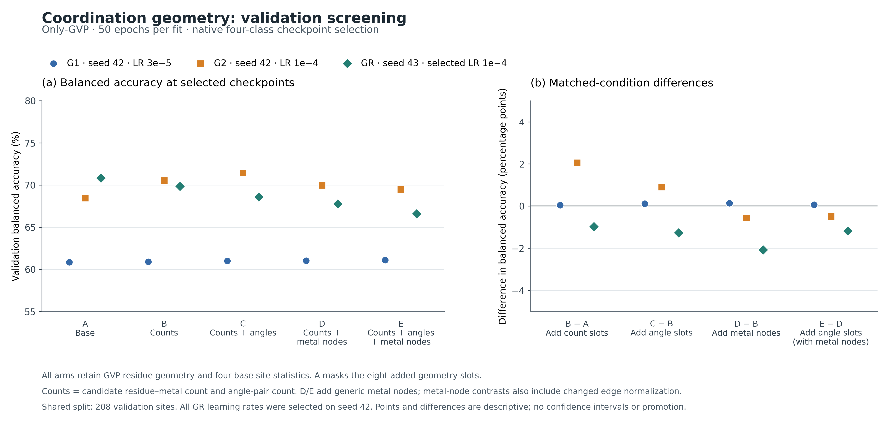

# Coordination-geometry pilot — 2026-09-15

Experiment ID: `metal/nonoverlap/coordination-geometry-pilot/2026-09-15`.
Profile: `metal_coordination_geometry_pilot_v1`.

## Outcome and evidence level

**All five smokes and 15 full 50-epoch fits completed and were verified locally
and in Drive. No geometry arm is promoted.** The higher learning rate improved
every arm by 7.6–10.4 percentage points in model seed 42. Smaller advantages
from candidate counts or angle summaries changed direction in seed 43.
Metal-node arms had lower mean balanced accuracy under this fixed recipe,
with substantial class-recall tradeoffs.

The selected-LR results are **Grade 3: two training seeds on one fixed
validation split**. Seed 43 repeats model training on the same validation
proteins; it does not test a new data split. The initial two-LR screen is
single-seed evidence. There are no grouped-fold confidence intervals,
promotion, or held-out results.

Validation prediction export also completed: 15 selected-checkpoint CSVs and
12 descriptive paired-error records were verified. It performed no training
or checkpoint reselection. The shared GPU subsequently completed all 30
original architecture fits and stopped at **11:37:34.517659 UTC**. Both
allocations together used **5.350957 hours** of the original ten-hour cap.
The [verified shared stop receipt](../raw/metal_architecture_pilot_20260915/continuation/closeout_allocation2/post_stop/session_stopped.json)
and [closed allocation report](../raw/metal_architecture_pilot_20260915/continuation/closeout_allocation2/post_stop/post_stop_closeout.json)
certify teardown separately from the pre-stop finalization capture.

## Comparison identity

| Arm | Added site summaries | Explicit generic metal nodes |
|---|---|---|
| A | All eight added slots masked | No |
| B | Candidate counts | No |
| C | Candidate counts and angular summaries | No |
| D | Candidate counts | Yes |
| E | Candidate counts and angular summaries | Yes |

All arms use the same 12-dimensional site input (four existing features plus
eight controlled slots), generic node-type machinery, GVP capacity, and
residue-only readout. A retains the original GVP geometric inputs and the
four base site statistics: multinuclear flag, metal count, and minimum/mean
intermetal distances. GVP can already represent geometric relationships. A is
a fresh matched control; its added masked slots and node-type machinery
differ from the earlier legacy Only-GVP baseline.

As run:

- Direct-four Only-GVP, with Mn, Cu, Zn, and Class VIII = Fe+Co+Ni.
- Non-overlap PinMyMetal training membership, certified training-only PROPKA
  overlay, and the original pilot's native-six-eligible cohort.
- 1,181 training pockets and 208 validation pockets; 1,151/110 PDB groups,
  with no PDB overlap. Split seed 42, validation fraction 0.15, `pdbid`
  grouping, and `metal_site` stratification remain fixed.
- Five one-epoch smokes; G1 and G2 test LRs `3e-5` and `1e-4` with model seed
  42; GR repeats each arm's selected LR with model seed 43. Every full fit
  runs 50 epochs. All five arms selected `1e-4` by the declared validation rule.
- Native `val_metal_balanced_acc` selects each checkpoint. All metrics below
  refer to that selected checkpoint, not the final epoch or an alternative
  checkpoint selected for a different metric.
- Conservative features, batch 8, fixed LR schedule, inverse-frequency class
  weights, no RING or augmentation, extraction 10 Å, residue-edge radius 6 Å,
  pooling cutoff 0, and explicit residue-only pooling.

The [playbook](../../METAL_TRAINING_PIPELINE_PLAYBOOK.md#bounded-coordination-geometry-pilot--stage-2b)
owns the exact recipe. The [manifest](../raw/metal_coordination_geometry_pilot_20260915/campaign_manifest.json)
and [per-run files](../raw/metal_coordination_geometry_pilot_20260915/runs/)
preserve its executed values.

## Learning-rate screen and seed repeats

All values are percentages. Mean ± SD uses the two runs at selected LR
`1e-4`; SD is the sample standard deviation across model seeds. The last
column is the lowest class recall observed in either selected-LR seed.

| Arm | G1: `3e-5`, seed 42 | G2: `1e-4`, seed 42 | GR: `1e-4`, seed 43 | Selected-LR BA mean ± SD | Worst class recall |
|---|---:|---:|---:|---:|---:|
| A | 60.845 | 68.473 | 70.809 | 69.641 ± 1.652 | 40.625 |
| B | 60.894 | 70.530 | 69.842 | 70.186 ± 0.487 | 34.375 |
| C | 61.011 | 71.437 | 68.577 | 70.007 ± 2.022 | 40.625 |
| D | 61.027 | 69.967 | 67.764 | 68.865 ± 1.558 | 31.250 |
| E | 61.095 | 69.480 | 66.579 | 68.030 ± 2.051 | 15.625 |

The G1 range was only 0.250 percentage points. Increasing the LR raised BA
by 7.628, 9.637, 10.426, 8.940, and 8.385 points for A–E, respectively.
These effects apply to the tested recipe and seed; they do not establish an
optimal LR range. The larger LR did not improve every class: for example,
E's minimum recall fell despite its higher BA.

[SVG figure](../raw/metal_coordination_geometry_pilot_20260915/analysis/geometry_screening.svg),
[plotted values](../raw/metal_coordination_geometry_pilot_20260915/analysis/geometry_screening_values.csv),
and [figure provenance](../raw/metal_coordination_geometry_pilot_20260915/analysis/geometry_screening_provenance.json)
are preserved separately. Exact selected epochs and unrounded metrics are in
the [two-seed analysis](../raw/metal_coordination_geometry_pilot_20260915/geometry_two_seed_analysis.json)
and [run table](../raw/metal_coordination_geometry_pilot_20260915/geometry_screen.csv).

## Matched component contrasts

BA differences below are percentage points at LR `1e-4`, candidate minus
reference. The E−C row is arithmetic from the corresponding selected-run
values; the other rows are recorded directly in the two-seed analysis.

| Contrast | Question | Seed 42 | Seed 43 | Mean difference |
|---|---|---:|---:|---:|
| B−A | Add candidate counts without metal nodes | +2.057 | −0.967 | +0.545 |
| C−B | Add angular summaries without metal nodes | +0.906 | −1.264 | −0.179 |
| D−B | Add metal nodes with counts fixed | −0.564 | −2.078 | −1.321 |
| E−C | Add metal nodes with counts and angles fixed | −1.957 | −1.998 | −1.977 |
| E−D | Add angular summaries with metal nodes | −0.487 | −1.184 | −0.836 |

B has the largest observed two-seed mean, but its advantage over A reverses
between seeds and it has lower worst-class recall. Counts and angular
summaries therefore have no consistent benefit established by this pilot.
The metal-node contrasts and E−D are negative in both high-LR seeds. This
supports deprioritizing those tested configurations under this budget; it
does not reject metal nodes or angular representations generally.

Adding metal nodes also adds edges used in fitting edge-distance and
sequence-separation normalization. The node contrasts test representation,
connectivity, and fitted edge normalization together. Residue-node
normalization excludes metal nodes. A/B/C share one normalization hash and
D/E share another across every block, as verified in the
[normalization controls](../raw/metal_coordination_geometry_pilot_20260915/geometry_normalization_controls.json).
C−B and E−D preserve graph construction and normalization. No nodes-only arm
with all added geometry slots masked was run.

## Class recalls and validation limits

These are mean recalls across seeds 42/43 at selected LR `1e-4`:

| Arm | Mn | Cu | Zn | Class VIII |
|---|---:|---:|---:|---:|
| A | 77.835 | 86.667 | 43.750 | 70.313 |
| B | 83.505 | 93.333 | 39.063 | 64.844 |
| C | 77.320 | 93.333 | 42.188 | 67.188 |
| D | 90.722 | 93.333 | 32.813 | 58.594 |
| E | 86.598 | 93.333 | 26.563 | 65.625 |

Validation support is Mn 97, Cu 15, Zn 32, and Class VIII 64 pockets, across
110 PDB groups. Sites within a PDB are not independent. E's seed-43 Zn recall
is 15.625% (5/32), which is hidden by reporting only its overall BA. Direct
four-class training does not provide separate Fe, Co, and Ni recalls.

The [validation export report](../raw/metal_coordination_geometry_pilot_20260915/validation_export_evidence/validation_prediction_export/validation_prediction_export.json)
verifies all 15 selected-checkpoint metrics and their CSV hashes on the same
208 validation sites. The
[paired error records](../raw/metal_coordination_geometry_pilot_20260915/validation_export_evidence/validation_prediction_export/paired_validation_errors.json)
contain 12 descriptive comparisons for B−A, C−B, D−B, and E−D across G1,
G2, and GR. These are post-training diagnostics; no held-out data,
reselection, new training, or confidence intervals were used. They do not
constitute a new validation sample. The earlier two-seed analysis was generated
before this export, so its statement that case-level pairing was unavailable
describes that earlier artifact.

The subsequent [paired-case analysis](../raw/metal_coordination_geometry_pilot_20260915/geometry_paired_case_analysis.json)
verifies all 15 CSV hashes, the ten high-LR confusion matrices, and ordered
site/target identities. At high LR, C−B corrects 22 previously wrong sites but
introduces 19 new errors in seed 42; in seed 43 those counts are 12 and 22.
Its unchanged Zn recall in seed 42 hides four corrections and four new
errors. E−D has 9 corrections/10 new errors and 15/17, respectively.
These are descriptive changes on the same sites, not independent replication
or a causal explanation of which geometric feature affected a prediction.

The distinction between accuracy and balanced accuracy also matters: B−A in
seed 43 has two more correct sites overall, but BA falls by 0.967 points.
Its changes are Mn +11, Cu +1, Zn −4, and Class VIII −6 correct sites;
balanced accuracy gives each class equal weight rather than each site.

## Input geometry coverage and limitations

The [coverage audit](../raw/metal_coordination_geometry_pilot_20260915/geometry_input_coverage.json)
records 25/1,181 training and 16/208 validation sites with no angle pairs;
their angular zeros are padding, not observed zero-degree angles. There are
8/1,181 and 7/208 sites with no candidate residue–metal pairs, respectively.
Multi-metal sites account for 314 training and 34 validation pockets.

The unchanged helper uses up to two listed donor atoms per residue and keeps
the nearest candidate for each residue–metal pair, with a functional-group
centroid fallback. A first-shell override can exceed the usual candidate
cutoff. Waters, cofactors, noncanonical residues, and intra-residue bidentate
angles are omitted. Angles are formed within metal centers and then pooled
across centers. These are candidate-geometric summaries, not certified
coordination numbers or complete coordination-shape labels; the 90°/180°
proxy does not distinguish square-planar from octahedral coordination.

The eight summary slots cannot recover centroid-fallback frequency, unique
first-shell counts, per-center distributions, or degenerate-vector frequency.
The audit describes inputs and cannot explain specific prediction errors by
itself. Generic node types and geometry contain no encoded target element ID.

## Provenance, persistence, and operational state

| Item | Verified identity |
|---|---|
| Geometry source archive SHA256 | `42b492e9a07ba29fd3bb1adabb38acfad538d7e30c71f32dd22a545399c46652` |
| Geometry manifest SHA256 | `80d434e805c8dd341960f4c0c67dfb886fa9152e6249c6d9f82d76aa6f988ba2` |
| Parent architecture manifest SHA256 | `14010a873801cdbc2d067b8e61137f5469afb4f5d9f833cdd2251fa84080cdd5` |
| Shared cohort SHA256 | `60b8af63454883579a2e851fa9a1cc7ddecdc95c53d996240241a099c35bbbe1` |
| Overlay manifest SHA256 | `41ef6627ee3c1d1595de8d1ca1fe0f03f8453cea7d6d7fff2376f8ddfd3fdef7` |

The runtime used G4 NVIDIA RTX PRO 6000 Blackwell, stock PyTorch
2.11.0+cu128/CUDA 12.8, and Python 3.13.15. The geometry preflight took
98.128 seconds. The 15 full-fit attempt durations total 4,185.347 seconds;
that is not total allocated time and excludes separate setup, smokes,
transfers, export, and the original campaign. Both profiles share the original
600-minute cap and cumulative allocation ledger. The 10-second GPU sampler
does not establish precise training-memory peaks.

All 21 geometry attempt receipts cover one readiness attempt, five smokes,
and 15 full fits. The
[last training archive](https://drive.google.com/file/d/1E85QQd-xhY76Ps0wcc9E3kL_HsWi-H4X/view)
and [its receipt](../raw/metal_coordination_geometry_pilot_20260915/transfer_receipts/attempt_021.json)
are verified. The separate
[validation-export archive](https://drive.google.com/file/d/1bzT5SajnWr5ErjE_vg9OLWfJAuj88RDa/view)
and [receipt](../raw/metal_coordination_geometry_pilot_20260915/validation_export_evidence/transfer_receipt.json)
preserve its replay provenance and prediction evidence.

The copied training aggregate is the exact snapshot used by the two-seed
analysis. Its embedded `awaiting_archive_transfer` state predates the final
receipt and the runner's subsequent finalization; it is not the final queue
state. The genuine [finalization snapshot](../raw/metal_coordination_geometry_pilot_20260915/finalization/)
now verifies all 15 full fits, five smokes, zero pending runs and a completed
queue. Its [transfer receipt](../raw/metal_coordination_geometry_pilot_20260915/finalization/transfer_receipt.json)
certifies the [shared final capture](https://drive.google.com/file/d/1lgvyKm5fm5436TdiU_VhmVhNqkHWaum0/view),
archive SHA `be9aaf95392b96c88f649c06b732a6ec91980daf18c0a6829cf88e8b0f8a2e3e`.
That capture correctly retains `gpu_stopped=false` because it preceded
shutdown. The later [post-stop receipt](../raw/metal_architecture_pilot_20260915/continuation/closeout_allocation2/post_stop/transfer_receipt.json)
verifies [persisted closeout](https://drive.google.com/file/d/1O3JQJnZ_GxE784rPd4OwI_1qiyDwNNuU/view).
The first allocation's stop receipt remains historical; the second session's
stop and cumulative closed ledger are the shared proof linked above.

Exact copied files and SHA256 values are listed in the
[portable inventory](../raw/metal_coordination_geometry_pilot_20260915/portable_copy_manifest.tsv).
Checkpoint binaries and caches remain in verified local/Drive storage.
[Current status](../../../EXPERIMENT_STATUS.md) owns the next action. The
completed original architecture campaign did not alter this geometry design.
