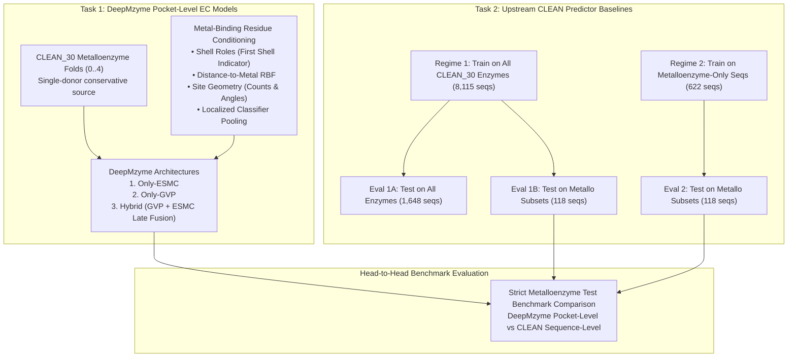
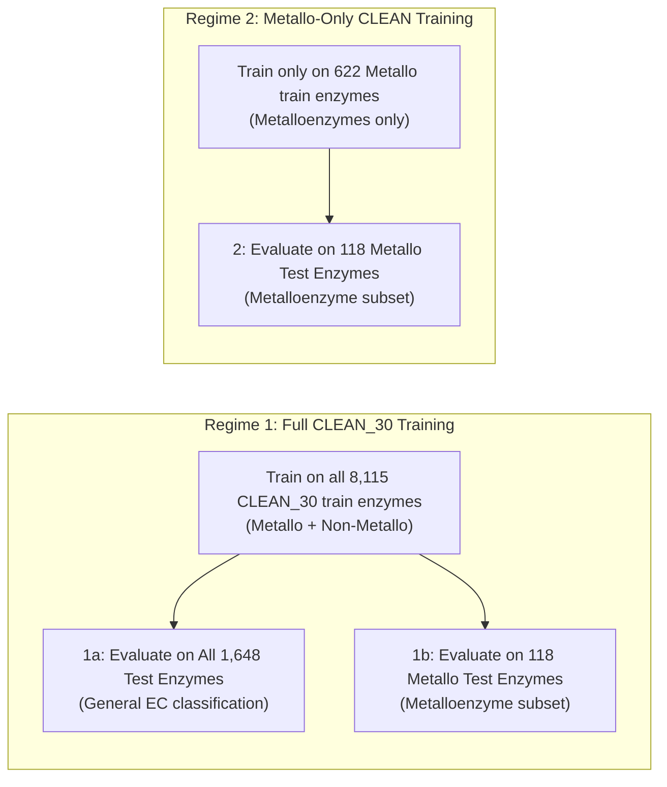
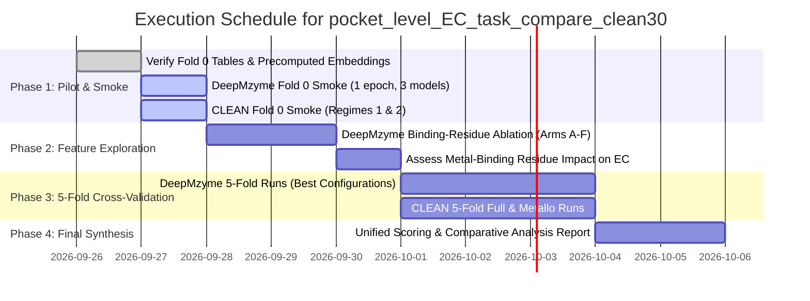

# pocket_level_EC_task_compare_clean30

## 1. Executive Summary & Research Objectives

This plan formalizes the research design, model matrix, feature ablations, and comparative benchmarking for enzyme function (EC number) classification on the **CLEAN_30** benchmark.

The investigation is divided into two primary, complementary tasks:

### Key Scientific Questions
1. **Pocket Structure vs Sequence Embeddings:** How does localized pocket-level 3D structural modeling (GVP) and pocket ESMC embeddings compare against global full-sequence contrastive representations (CLEAN ESM-1b) on metalloenzymes partitioned at strict 30% sequence identity?
2. **Value of Metal-Binding Residue Conditioning:** In prior metal-classification experiments, explicit coordination flags, candidate ligand counts/angles, and shell indicators were benchmarked. Does providing explicit knowledge of metal-coordinating / first-shell residues significantly boost pocket-level EC classification, or does GVP geometric message passing already capture this implicitly?
3. **Domain Specificity in CLEAN:** Does training the contrastive CLEAN model exclusively on metalloenzymes improve test accuracy on metalloenzymes, or does training on the entire 8,100+ enzyme universe yield better representations through transfer and negative sampling?

---

## 2. Datasets, Cohorts, and Split Architecture

### 2.1 CLEAN_30 Metalloenzyme Cohort (DeepMzyme Input)
- **Authoritative Directory:** `DeepMzyme_Data/CLEAN_30_main` (symlink to `CLEAN_30_shared_single_donor_supported_metal_conservative`).
- **Data Derivation:** Derived from the official CLEAN split30 splits via AlphaFill catalytic metal transfer, MAHOMES activation, and conservative single-donor filtering (ensuring exactly one representative AlphaFill donor structure per UniProt accession to eliminate donor redundancy).
- **Split Units:** 5 predefined benchmark fold pairs (`CLEAN_30_train_test_split_0` through `CLEAN_30_train_test_split_4`).
- **Cohort Statistics per Fold:**
  - Fold 0: 743 train pockets (622 unique structures), 139 test pockets (118 unique structures).
  - Fold 1: 698 train pockets (578 unique structures), 128 test pockets (109 unique structures).
  - Fold 2: 668 train pockets (562 unique structures), 148 test pockets (121 unique structures).
  - Fold 3: 696 train pockets (586 unique structures), 119 test pockets (98 unique structures).
  - Fold 4: 723 train pockets (612 unique structures), 124 test pockets (99 unique structures).
- **Validation Splitting:** For each fold, internal validation uses a 15% grouped split by UniProt accession / `pdbid` from the fold's `train` split. The fold's `test` split remains strictly held out until the final evaluation gate.

### 2.2 Full CLEAN_30 Cohort (All Enzymes)
- **Authoritative Directory:** `DeepMzyme_Data/CLEAN_all_train_valid_splits/split30/`.
- **Files:** `split30_train_split_{0..4}.csv` and `split30_test_split_{0..4}_curate.csv`.
- **Volume:** ~8,115 train sequences and ~1,648 test sequences per fold, covering all enzyme classes regardless of metal-binding capability.

---

## 3. Part 1: DeepMzyme Pocket-Level EC Training Matrix

### 3.1 Task Formulation & Objectives
- **Target Task:** Pocket-level EC classification.
- **Label Scope:** Initial primary target is Level-1 EC classification (7 classes: EC 1 Oxidoreductases, EC 2 Transferases, EC 3 Hydrolases, EC 4 Lyases, EC 5 Isomerases, EC 6 Ligases, EC 7 Translocases).
- **Hierarchical Roadmap:** Once Level-1 baselines are stabilized across folds, extend to Level-2 sub-subclasses.
- **Group Weighting:** Because a single enzyme structure may have multiple catalytic metal pockets (e.g. multi-domain or homooligomeric sites), training applies sample weighting grouped by `structure_id` (using `--ec-group-weights structure_id`) to ensure each enzyme contributes equally to the EC loss.
- **Loss Function:** Cross-entropy on Level-1 classes; optional secondary supervised contrastive loss (`--ec-contrastive-weight 0.0` for baseline; `0.1` explored in tuning).

### 3.2 Model Families
Three core model families will be trained under matched conditions:
1. **`Only-ESMC` (`--model-architecture only_esm`):**
   - Extracts residue-level ESMC embeddings for all residues present in the catalytic pocket.
   - Dual pooling: Global mean pooling concatenated with attention pooling (`AttentionPool`).
   - 2-layer MLP classifier head with SiLU and dropout (`0.2`).
2. **`Only-GVP` (`--model-architecture only_gvp`):**
   - 3D structural pocket graph with GVP message passing (GVP-GNN).
   - Conservative node features, backbone vector features, RBF radial edge distances.
   - Edge radius: 8.0 Å (with optional RING edge interactions).
3. **`Hybrid` / Late Fusion (`--model-architecture gvp --fusion-mode late_fusion`):**
   - Joint structural-sequence architecture.
   - Structural GVP encoder processes the 3D pocket graph; ESM graph encoder processes the pocket ESMC embeddings.
   - Latent representations are projected, gated, and concatenated with site statistics before the classifier head.

### 3.3 Metal-Binding Residue Conditioning Study

To address the user's specific request:
> *"If the additional info of the binding residues of metal, helped before in the metal level samples training/test performance evaluation for the esmc or graph only or hybrid - please also try if help here."*

Prior metal-classification experiments revealed key insights regarding metal-coordinating residues:
- In `PARAMETER_FINDINGS.md`, candidate ligand counts and angles provided localized geometric cues, but explicit metal nodes (`per_metal`) caused trade-offs in edge normalization and class recalls.
- Residues directly coordinating metals (`first_shell`, donor distance $\le 3.0$ Å) form the active catalytic machinery.

We systematically evaluate whether informing the models about metal-binding residues improves pocket-level EC classification:

| Arm | Description | Implemented Configuration Flags | Applied To |
|:---|:---|:---|:---|
| **Arm A (Standard Pocket Baseline)** | Standard pocket graph; all pocket residues within extraction radius treated uniformly without explicit metal-binding tags. | `--site-geometry-features none --classifier-pool-distance-cutoff 0.0` | ESMC, GVP, Hybrid |
| **Arm B (First-Shell Shell Role Indicator)** | Injects binary `is_first_shell` flag into node scalar features (`x_role`), marking direct metal-coordinating residues. | Implemented in `src/graph/features.py` via `x_role[:, 0]` | GVP, Hybrid |
| **Arm C (Distance-to-Metal Center Conditioning)** | Injects continuous RBF-expanded distances from each residue's $C_\alpha$ and sidechain to the catalytic metal center. | `--node-rbf-use-raw-distances false` (standard RBF distance expansion in `NodeScalarEncoder`) | GVP, Hybrid |
| **Arm D (Candidate Coordination Counts & Angles)** | Adds candidate ligand counts (`log1p`) and coordination angles to site feature vectors. | `--site-geometry-features counts_angles` | GVP, Hybrid |
| **Arm E (Binding-Residue Focused Classifier Pooling)** | Restricts the classifier readout pooling to the immediate coordination sphere ($\le 5.0$ Å from metal) vs whole pocket. | `--classifier-pool-distance-cutoff 5.0` | ESMC, GVP, Hybrid |
| **Arm F (First-Shell Scoped ESMC Injection)** | In Hybrid models, restricts early ESM injection or cross-attention specifically to first-shell coordinating residues. | `--early-esm-scope first_shell` or `--cross-attention-neighborhood first_shell` | Hybrid |

### 3.4 DeepMzyme Training Protocol & Hyperparameters
- **Optimization:** AdamW, learning rates matched across families: `3e-5` and `1e-4`.
- **Weight Decay:** `1e-4`.
- **Batch Size:** 8 (or 4 with grad-accum 2 for memory safety on larger graphs).
- **Epochs:** 40 epochs with early checkpoint selection based on validation performance.
- **Selection Metric:** `val_ec_group_level_1_balanced_acc` (Level-1 balanced accuracy on the internal grouped validation set).
- **Random Seeds:** Seeds 42 and 43 for all pilot and confirmation runs.

---

## 4. Part 2: Upstream CLEAN Predictor Baseline Matrix

The upstream CLEAN model (*Enzyme Function Prediction by Machine Learning using Distance-based Representation*, Tianhao et al.) uses ESM-1b embeddings trained with Supervised Triplet Loss / Max-Separation inference.

We evaluate CLEAN under the **two user-specified training regimes** across the CLEAN_30 benchmark folds:

### 4.1 Regime 1: Full CLEAN_30 Training (All Enzymes)
- **Training Set:** `split30_train_split_{k}.csv` (~8,115 enzymes per fold).
- **Model:** `clean30_sdsmc_fold{k}_full_triplet`.
- **Evaluation 1a (All Enzymes):**
  - Evaluated on `split30_test_split_{k}_curate.csv` (~1,648 test proteins).
  - Measures the general enzyme classification performance across all EC classes and protein folds.
- **Evaluation 1b (Metalloenzymes Only):**
  - Evaluated on `clean30_sdsmc_fold{k}_metallo_test.csv` (~118 test proteins).
  - Isolates how well a universally trained sequence model performs specifically on the metalloenzyme subset.

### 4.2 Regime 2: Metalloenzyme-Only CLEAN Training
- **Training Set:** `clean30_sdsmc_fold{k}_metallo_train.csv` (~622 metalloenzymes per fold).
- **Model:** `clean30_sdsmc_fold{k}_metallo_triplet`.
- **Evaluation 2 (Metalloenzymes Only):**
  - Evaluated on `clean30_sdsmc_fold{k}_metallo_test.csv` (~118 test proteins).
  - Directly tests whether restricting CLEAN's contrastive embedding space to metalloenzymes improves specificity or hurts due to fewer negative examples and lower diversity.

### 4.3 CLEAN Configuration & Execution Workflow
- Follows [CLEAN/train_clean_predictor_baselines.ipynb](file:///home/mechti/PycharmProjects/DeepMzyme/CLEAN/train_clean_predictor_baselines.ipynb).
- **Embeddings:** ESM-1b (1280-dim) per protein sequence.
- **Distance Map & Mutated Single-EC Augmentation:** Standard official CLEAN preprocessing (`mutate_single_seq_ECs`, `compute_esm_distance`).
- **Optimization:** Triplet margin loss, learning rate `5e-4`, 2500 epochs (recommended official setting; 200 epochs for smoke testing).
- **Inference & Scoring:** `infer_maxsep` with Top-1 accuracy, Macro-F1, Micro-F1, and Macro-Recall at EC Level 1 and Level 2.

---

## 5. Metrics, Statistical Governance, and Head-to-Head Comparison

### 5.1 Common Evaluation Metrics
To allow strict comparison between DeepMzyme (pocket-level) and CLEAN (sequence-level), all models will be scored on the exact same held-out metalloenzyme test proteins using standardized metrics:

1. **Top-1 Prefix Accuracy:** Fraction of test proteins where the predicted top-1 EC prefix matches any ground-truth EC prefix.
2. **Level-1 Balanced Accuracy:** Unweighted mean of recall across all active EC classes (protects against class imbalance).
3. **Macro F1 & Macro Recall:** Multi-label / multi-class macro-averaged scores across active classes.
4. **Per-Class Recall Diagnostic:** Explicitly auditing performance on majority classes (EC 1, EC 2, EC 3) versus rare classes (EC 5 Isomerases, EC 7 Translocases).

### 5.2 Comparative Analysis Table Schema

The final cross-benchmark results will be synthesized in the following structured comparison table:

| Benchmark / Model | Training Scope | Target Inputs | Test Cohort | Level-1 Bal. Acc. (%) | Top-1 Acc. (%) | Macro F1 | Per-Class Recall (EC 1..7) |
|:---|:---|:---|:---|:---:|:---:|:---:|:---:|
| **CLEAN (Regime 1a)** | All Enzymes (8,115) | Full Sequence (ESM-1b) | All Test (1,648) | — | — | — | — |
| **CLEAN (Regime 1b)** | All Enzymes (8,115) | Full Sequence (ESM-1b) | Metallo Only (118) | — | — | — | — |
| **CLEAN (Regime 2)** | Metallo Only (622) | Full Sequence (ESM-1b) | Metallo Only (118) | — | — | — | — |
| **DeepMzyme Only-ESMC (Baseline)** | Metallo Only (622) | Pocket Residues (ESMC) | Metallo Only (118) | — | — | — | — |
| **DeepMzyme Only-ESMC (+ Binding Residues)** | Metallo Only (622) | Pocket + Binding Info | Metallo Only (118) | — | — | — | — |
| **DeepMzyme Only-GVP (Baseline)** | Metallo Only (622) | Pocket Graph (3D) | Metallo Only (118) | — | — | — | — |
| **DeepMzyme Only-GVP (+ Binding Residues)** | Metallo Only (622) | Pocket + Binding Info | Metallo Only (118) | — | — | — | — |
| **DeepMzyme Hybrid (Baseline)** | Metallo Only (622) | Graph + ESMC | Metallo Only (118) | — | — | — | — |
| **DeepMzyme Hybrid (+ Binding Residues)** | Metallo Only (622) | Graph + ESMC + Binding Info | Metallo Only (118) | — | — | — | — |

*Note: All scores reported as mean $\pm$ sample SD across the 5 benchmark folds.*

---

## 6. Implementation Roadmap & Execution Schedule

### Phase 1: Environment Readiness & Fold 0 Smoke Test
- Verify precomputed ESMC embeddings and 3D structures for `CLEAN_30_main` Fold 0.
- Execute 1-epoch smoke tests for:
  - DeepMzyme `Only-ESM`, `Only-GVP`, and `Hybrid` on Fold 0.
  - CLEAN baseline notebook table synchronization and fast-step execution.

### Phase 2: Metal-Binding Residue Conditioning Study (Fold 0 Pilot)
- Conduct matched 40-epoch runs across the binding-residue ablation arms (Arms A through F) on Fold 0 across 2 seeds (42, 43).
- Determine whether first-shell indicators, continuous distance-to-metal, or localized pooling yield statistically meaningful improvements in Level-1 EC balanced accuracy.

### Phase 3: 5-Fold Cross-Validation Campaign
- Run the selected best configurations for DeepMzyme `Only-ESMC`, `Only-GVP`, and `Hybrid` across all 5 folds (Folds 0..4).
- Execute CLEAN Regime 1 and Regime 2 across all 5 folds.

### Phase 4: Synthesis & Publication-Grade Deliverables
- Aggregate fold metrics (mean $\pm$ SD).
- Generate confusion matrices and per-class recall breakdowns.
- Compile final report document and update `EXPERIMENT_STATUS.md`.
